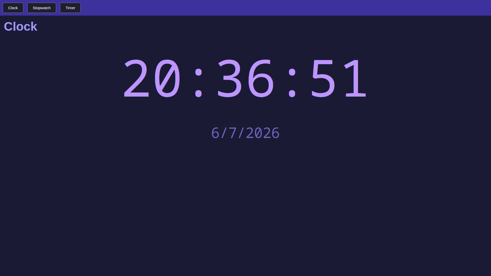
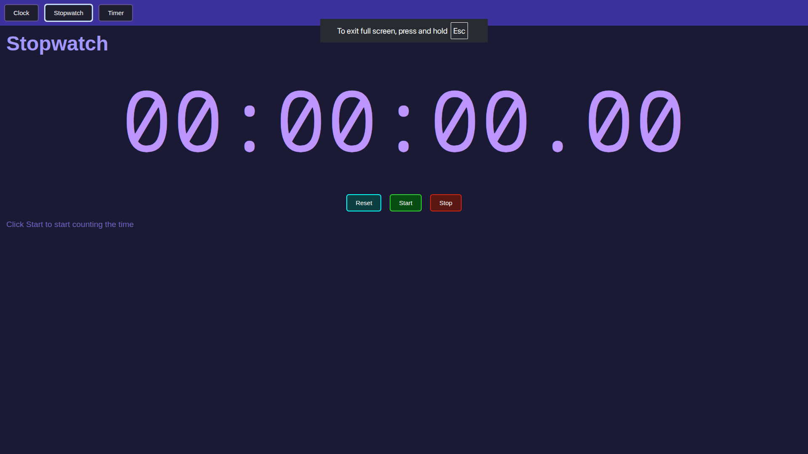

# Web Clock App

A simple web-based clock application for stopwatch, timer, and clock.

## Screenshots

## Live Demo
You can find the live demo by clicking the button below:
or by visiting the url:
[Clock Web App](https://akshayk-960.github.io/Clock-Web-App/)
(or copy and paste "  akshayk-960.github.io/Clock-Web-App  " in a new tab.)

## Features
* Real-Time clock tab
* High precision stopwatch with precise times upto 2 centisecond values
* Timer with countdown bar
* Fully styled and functional website using Javascript and CSS.

## How it works
For this project, I used HTML and Javascript to create the webpage and the functionality. I added CSS to the code later on to add a purple theme and animations to the buttons
 

## Credits
Thoughout this project, I used helpful websites including

* https://w3schools.com/ (for help with CSS)
* https://markdownguide.org/ (for help with writing the README.md file)
* https://developer.mozilla.org/ (for help with HTML and some JS)
